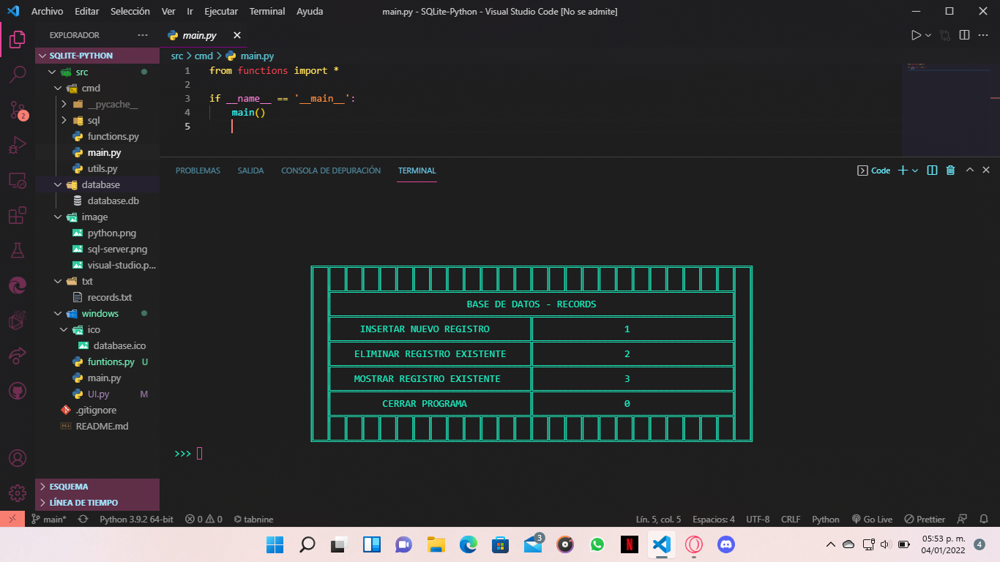
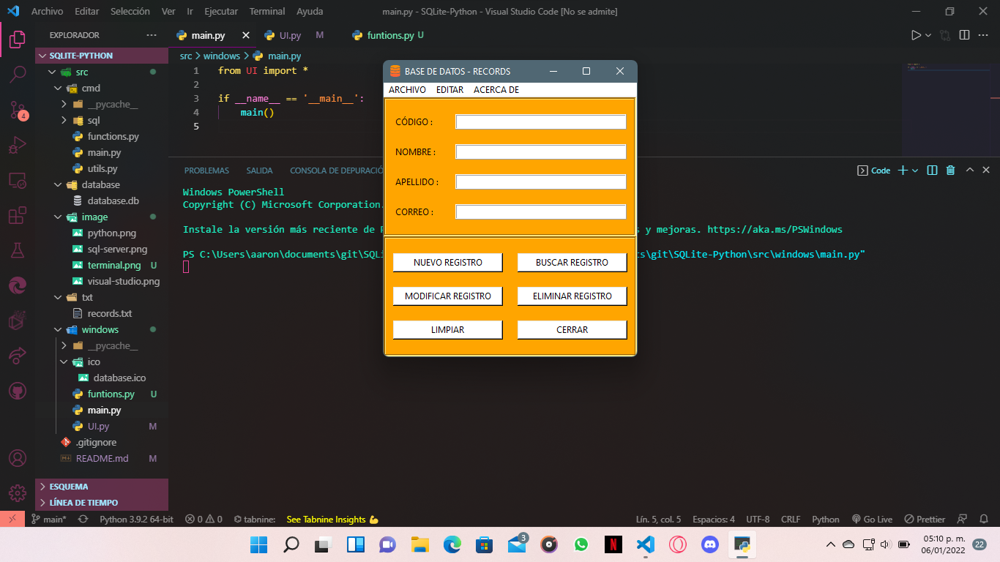

<h1 align = "center">SQLite-Python</h1>

<p align="center">
  <a href="#about">Acerca de</a> &#xa0; | &#xa0; 
  <a href="https://github.com/AaronF11" target="_blank">Autor</a>
</p>

<h2 align="center" id="about"> Sobre el repositorio </h2>

<center>Segunda version de SQL-PYTHON-Practicas

</center>
<hr>
<h3 align="center">Versión en terminal</h3>



<hr>
<h3 align="center">Versión gráfica</h3>



<hr>

## 💻 Tecnologias 

-  [Visual Studio Code](https://code.visualstudio.com/docs)
-  [Python](https://www.learnpython.org/es/)
-  [SQLite3](https://www.w3schools.com/sql/default.asp)

## 📖 Requisitos

1. Como editor de código [Visual Studio Code](https://code.visualstudio.com)
2. Extensión SQLite en Visual Studio Code [SQLite](https://marketplace.visualstudio.com/items?itemName=alexcvzz.vscode-sqlite)
2. El compilador del lenguaje [Python](https://www.python.org)
3. Terminal de [Git](https://git-scm.com/downloads)

## 🚦Comenzar
```bash
# Clona el repositiorio
$ git clone https://github.com/AaronF11/SQLite-Python

# Ve a la carpeta
$ cd SQLite-Python

# Abrir la carpeta con Visual Studio Code
$ code . 
```